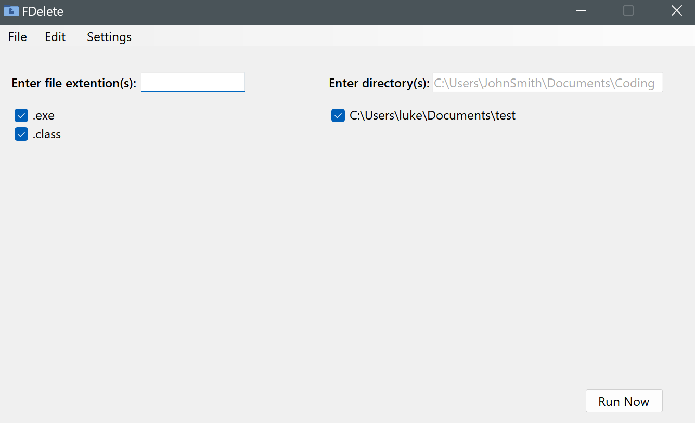

# FDelete
This Windows application deletes files based on their extension.   

## How to Use
To add an extension to the delete list, type the extension (including the '.') in the indicated textbox and press enter. To add a directory to the search list, type the entire directory in the indicated 
textbox and press enter. **Only checked extensions/directories will be run.** By default, unchecked items will be removed upon application close. This and other behaviors can be changed in settings
(see below.) Lastly, click the "run now" button to run the program. **All edit additions and settings will be autosaved in the "Resources" folder upon application close.**

## Edit Options
In the edit menu, you will find three options. 

### Validate New Extension
Add an extension to the valid extensions list. Extensions added here **will not** be flagged as invalid if extension validation is enabled. 

### Add Invalid Directory
Add a directory to the invalid directories list. Directories added here **will** be flagged as invalid if directory validation is enabled. By default, this list contains some essential Windows directories.

### Add Invalid File
Add a file to the invalid file list. Files added here **will not** be deleted, even if they meet the extension and directory requirements. The program file is automatically added to this list upon application opening.

## Settings Options
In the settings menu, you will find four options.

### Extension Validity Checking
Enable/disable extension validity checking. If enabled, each extension the user enters is compared against a near-exhaustive list of valid Windows extensions. 

### Directory Validity Checking
Enable/disable directory validity checking. If enabled, each directory the user enters is compared against a list of invalid "safe" directories. The program will also check if the directory exists.

### Run on Subdirectories
Enable/disable running on subdirectories. If enabled, the program will run on all subdirectories, sub-subdirectories, etc. of entered directories (unless it encounters an invalid directory and
directory validity checking is enabled.) If disabled, the program will only run on the entered directories, and not on any of their subdirectories.

### Delete Unchecked Items
Enable/disable deleting unchecked list items. If enabled, unchecked extensions and directories will be removed from their respective lists upon application close.

## Updating
Currently, updating the program will require re-downloading from this page.

## The Code
This is a .NET Windows application written in C#.

## Future Improvements
If interest is shown, I will create a Windows service that periodically runs this program in the background. I may also add loading configuration files.

## About
The name "FDelete" is creatively shortened from "File Delete". This program was created by Luke, a CS major at University of Central Florida.
